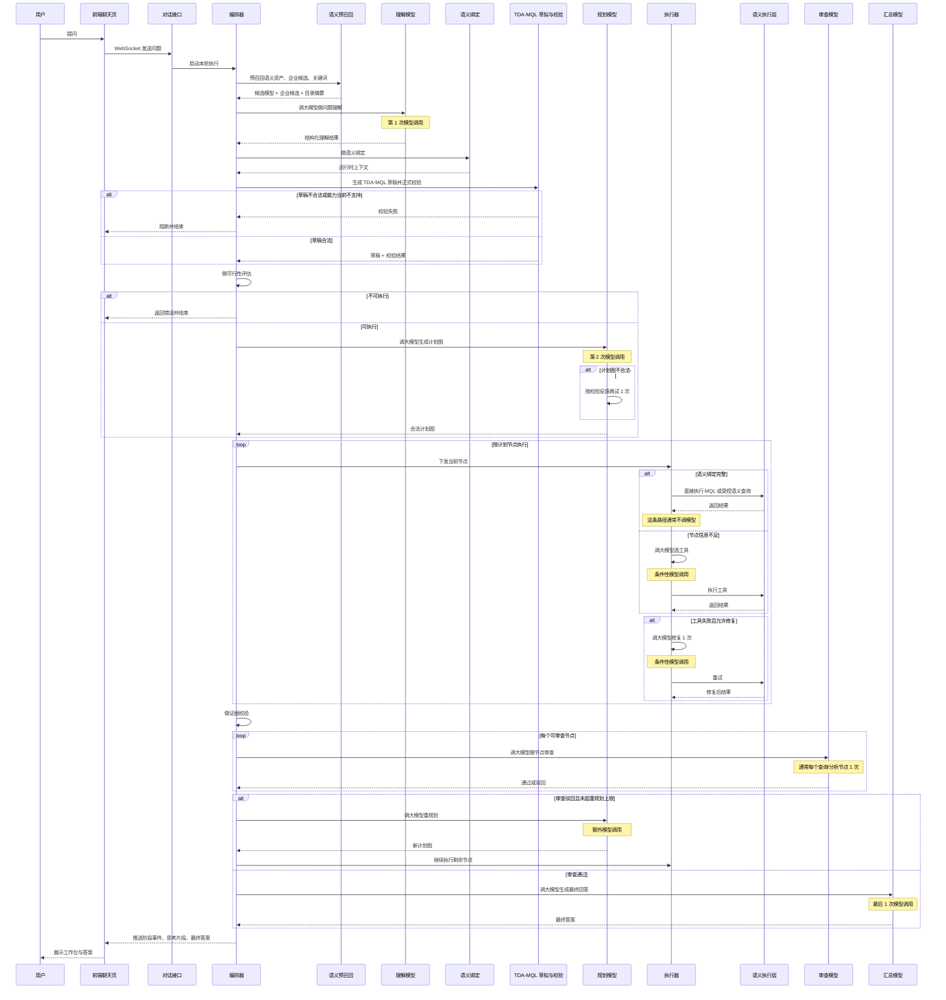

# 当前 Agent 实际流程说明

本文档以当前代码为准，沉淀以下内容：

- 当前系统实际运行的阶段表
- 当前系统真实调用时序图
- 大模型调用次数分析
- 当前方案的优点与不足
- 本轮优先改进的 3 个点，以及已完成的 2 个点

核心代码入口：

- `backend/app/api/chat_v3.py`
- `backend/app/agent/orchestrator.py`
- `backend/app/agent/stage_graph.py`
- `backend/app/agent/understanding_agent.py`
- `backend/app/agent/planner_agent_v2.py`
- `backend/app/agent/executor_agent_v2.py`
- `backend/app/agent/reviewer_agent_v2.py`

## 一、当前实际阶段总览

| 阶段 | 是否调用大模型 | 输入 | 输出 | 当前职责 |
| --- | --- | --- | --- | --- |
| 语义资产预召回 | 否 | 用户问题 | 候选语义模型、企业候选、关键词、分类目录 | 先用规则和语义目录把可能相关的资产捞出来 |
| 意图识别 | 是，1 次 | 用户问题、会话历史、语义预召回结果 | 结构化理解结果 | 识别问题类型、企业、期间、指标、维度、候选模型、证据要求 |
| 语义绑定 | 否 | 用户问题、理解结果、语义预召回结果 | 运行时上下文、入口模型、实体过滤、推荐工具 | 把问题绑定到当前轮可执行的语义资产上 |
| TDA-MQL 草拟 | 否 | 语义绑定结果、理解结果 | TDA-MQL 草稿、正式校验结果 | 生成受控 MQL 草稿，并立即做 schema + 语义约束校验 |
| 可行性评估 | 否 | 运行时上下文、理解结果 | 可执行/不可执行结论 | 检查候选语义资产、实体解析、执行约束是否就绪 |
| 计划生成 | 是，1 到 2 次 | 用户问题、会话历史、理解结果、运行时上下文 | 计划图 | 生成可执行计划图；第一次不合法时最多再试 1 次 |
| 指标执行 | 通常否 | 当前节点、语义绑定、前序结果 | 指标结果 | 优先直接走 `mql_query` 或受控语义查询 |
| 明细下钻 | 通常否 | 当前节点、语义绑定、前序结果 | 明细结果 | 处理声明式 drill-down 节点 |
| 证据校验 | 否 | 计划图、执行结果 | 证据覆盖情况 | 统计行数、对比结果、错误节点、下钻节点 |
| 结果审查 | 是，通常每个查询节点 1 次 | 用户问题、单节点执行结果 | 审查结论 | 审查节点结果是否足够支撑后续结论 |
| 报告生成 | 是，1 次 | 用户问题、所有执行结果、计划图 | 最终答案 | 汇总真实执行证据，生成最终回答 |

## 二、当前真实调用时序图

## 三、大模型调用次数怎么计算

### 1. 固定最少调用

最少固定有 3 次：

1. 问题理解 1 次
2. 计划生成 1 次
3. 最终报告生成 1 次

### 2. 典型成功链路

如果计划里只有 1 个核心查询节点，并且执行阶段能直接走 `mql_query`，通常是：

1. 问题理解 1 次
2. 计划生成 1 次
3. 节点审查 1 次
4. 最终报告生成 1 次

也就是大约 4 次。

### 3. 条件性增加调用

- 计划生成第一次 JSON 不合法：规划阶段最多再补 1 次
- 执行阶段无法直接走语义执行：该节点会多 1 次“模型选工具”
- 工具失败后允许修复：该节点会多 1 次“模型修复”
- 审查阶段：通常每个查询/分析节点 1 次
- 审查打回重规划：会多 1 次重规划，再重新走后续执行和审查

## 四、目前这套流程的优点

### 1. 执行阶段已经不是“节点越多，大模型越多”

当前主路径已经是“语义优先执行”。只要语义绑定足够完整，执行阶段通常直接走 `mql_query` 或受控语义查询，不需要每个节点都再问一次大模型。

### 2. 阶段图已经显式化

现在前后端都能看到：

- 意图识别
- 语义绑定
- TDA-MQL 草拟
- 可行性评估
- 计划生成
- 指标执行
- 明细下钻
- 证据校验
- 结果审查
- 报告生成

这比早期“理解 -> 规划 -> 执行 -> 审查”的粗链路更容易观察和定位问题。

### 3. 税务对账已经开始走“语义资产优先”

现在的税务/账务/对账能力更多沉在语义资产和时间语义里，而不是直接往 Agent 提示词里堆硬编码，这个方向是对的。

## 五、目前仍然值得继续改进的 3 个点

### 改进点 1：去掉审查与汇总阶段的隐式兜底

原来存在的问题：

- 审查结果解析失败时会默认通过
- 审查异常时会默认通过
- 报告生成异常时会自动拼一个 fallback answer

这类行为会让系统“看起来成功了”，但其实已经偏离了真实状态。

本轮状态：**已完成**

- 审查失败现在会显式返回 `reject`
- 报告生成失败现在会显式阻断 `报告生成` 阶段，并输出错误事件
- 不再自动拼装“像成功一样”的最终答案

### 改进点 2：把 TDA-MQL 草拟从展示草稿升级成正式校验阶段

原来存在的问题：

- `TDA-MQL 草拟` 阶段只是拼一个骨架对象
- 不合法的字段、时间角色、组合能力，往往要到更后面才暴露

本轮状态：**已完成**

- 当前会在 `TDA-MQL 草拟` 阶段先做 `TdaMqlRequest` schema 校验
- 然后做正式编译校验
- 如果包含当前阶段不支持的能力，也会在这里直接阻断

### 改进点 3：审查阶段改成“规则先审，模型补审”

当前问题：

- 现在基本还是每个查询/分析节点都调一次审查模型
- 节点一多，成本和时延会线性上涨

建议方向：

- 先用规则检查结果完整性、行数、空结果、错误字段、对比结果覆盖度
- 只有命中不确定场景时，再补充模型审查

本轮状态：**未实现，留待下一阶段**

## 六、本轮改动后，系统行为发生了什么变化

### 1. 草拟阶段更早失败

现在如果 `TDA-MQL` 草稿本身就不成立，系统会在 `TDA-MQL 草拟` 阶段直接停下，而不是拖到执行时才失败。

### 2. 审查和汇总不再“悄悄成功”

现在如果：

- 审查模型没有返回合法结构化结果
- 审查阶段异常
- 最终报告生成异常

系统会显式把阶段标成失败或阻断，并结束当前轮次。

## 七、下一步建议

如果继续按当前方案往下推进，建议顺序是：

1. 做“规则先审、模型补审”
2. 继续补税务对账语义资产和真实问句回归集
3. 把 `TDA-MQL` 草拟阶段继续升级成更可回放的中间契约
4. 再考虑更完整的报告模板和知识层接入
