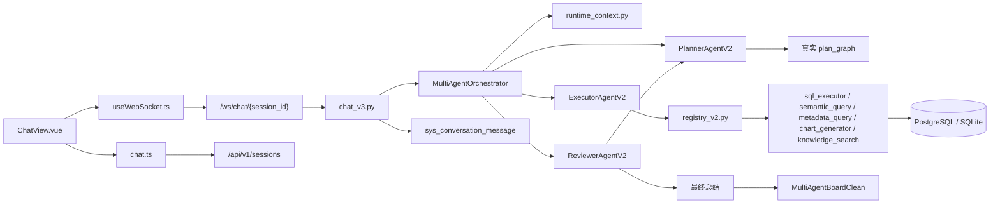

# 项目介绍与代码导读

## 1. 这是什么项目

这是一个 **TDA-TDP 语义化智能问数 Agent POC**。  
它的目标不是做通用聊天，而是围绕 **税务数据、账务数据、税账对账分析** 做一个可演示的智能问数系统：

- 前端负责展示会话、计划图、执行过程、结果表格和图表。
- 后端负责会话管理、语义查询、数据库访问和多智能体编排。
- 当前主链路已经从“单 Agent ReAct”升级成“Planner + Executor + Reviewer”三智能体协作。

一句话理解：

> 用户在前端提问，后端先识别问题类型和上下文，再由 Planner 出真实计划，Executor 按计划调用工具取数，Reviewer 做审查和总结，最后把完整过程和结论返回前端展示并落库。

---

## 2. 根目录在放什么

| 路径 | 主要内容 | 作用 |
| --- | --- | --- |
| `backend/` | FastAPI 后端、SQLAlchemy 模型、多智能体逻辑 | 系统的服务端实现 |
| `frontend/` | Vue3 + Element Plus + ECharts 前端 | 系统的页面、状态管理和可视化 |
| `scripts/` | `init_db.py` | 一键建表并灌入 Mock 数据 |
| `knowledge/` | `tax_regulations/`、`accounting_standards/`、`reconciliation_guides/` | 为后续 RAG/知识检索预留，目前目录存在但基本还是空壳 |
| `.cache/` | 临时目录、缓存 | 本项目约定把缓存尽量放到 D 盘项目内 |
| `CLAUDE.md` / `CODEX.md` / `DESIGN.md` | 交接、进展、设计方案 | 当前项目最重要的文档恢复面 |
| `docker-compose.yml` | 基础容器配置草稿 | 不是当前主运行方式 |

---

## 3. 后端代码包导读

## 3.1 `backend/app/`

这是后端真正的 Python 包根目录。

| 文件/目录 | 里面有什么 | 作用 |
| --- | --- | --- |
| `main.py` | FastAPI app、lifespan、CORS、路由注册 | 后端入口，当前注册的是 `router_v2.py` 和 `chat_v3.py` |
| `config.py` | `Settings`、`.env` 读取、数据库/LLM配置 | 集中管理运行配置 |
| `database.py` | `engine`、`AsyncSessionLocal`、`get_db()` | 管理异步数据库连接与会话 |
| `api/` | REST API 与 WebSocket 入口 | 对外暴露系统能力 |
| `agent/` | 多智能体编排与当前运行链路 | 当前问数主链路的核心 |
| `llm/` | `client.py` | 统一 OpenAI 协议客户端 |
| `mcp/tools/` | 工具注册与工具实现 | 给 Agent 调用的数据库/语义/知识工具 |
| `mock/` | Mock 数据与语义定义种子 | 初始化演示数据 |
| `models/` | SQLAlchemy ORM 模型 | 定义 28 张表 |
| `schemas/` | Pydantic 请求/响应模型 | 约束 API 输入输出 |
| `semantic/` | 语义查询执行与编译 | 支撑 `/semantic/query` 和 Agent 的 `semantic_query` |
| `rag/` | 仅有占位文件 | RAG 还没有真正落地 |

## 3.2 `backend/app/api/`

这一层负责“把后端能力暴露出来”。

### 当前主链路文件

| 文件 | 作用 |
| --- | --- |
| `router_v2.py` | 当前生效的 REST 路由汇总，聚合 `sessions`、`semantic_v2`、`datasource`、`preferences`、`mock_data_v2`、`health` |
| `chat_v3.py` | 当前生效的 WebSocket 问数入口，负责接收消息、创建/复用 orchestrator、回放历史、保存本轮执行轨迹 |
| `sessions.py` | 会话 CRUD 和消息历史读取 |
| `datasource.py` | 查看表清单、表结构、简单 SELECT 管理查询 |
| `semantic_v2.py` | 当前生效的语义模型管理和语义查询接口 |
| `preferences.py` | 用户偏好读写 |
| `mock_data_v2.py` | 清空并重建 Mock 数据，同时补种语义 YAML |
| `health.py` | 健康检查与数据库方言确认 |

### 清理说明

- 2026-03-30 已清理 `router.py`、`semantic.py`、`mock_data.py`、`chat.py`、`chat_v2.py`、`chat_ws.py` 等历史 API 文件。
- 当前 `backend/app/api/` 目录只保留正在被主链路使用的实现。

## 3.3 `backend/app/agent/`

这是项目最关键的包，负责把“问数”变成“可规划、可执行、可审查”的多智能体流程。

### 当前主链路文件

| 文件 | 作用 |
| --- | --- |
| `orchestrator.py` | 多智能体调度器。负责编排 Planner → Executor → Reviewer → 最终总结；支持 replan；对外持续产出 WebSocket 事件 |
| `runtime_context.py` | 运行时上下文识别器。负责识别 query_mode、期间、企业候选、相关语义模型、相关物理表和表 schema |
| `planner_agent_v2.py` | 当前 Planner。基于用户问题和 runtime_context 让 LLM 生成真实 DAG 计划，并做计划校验 |
| `executor_agent_v2.py` | 当前 Executor。按节点调用工具，并基于上下文限制工具集合；查询失败时支持自动修复重试 |
| `reviewer_agent_v2.py` | 当前 Reviewer。负责节点审查和最终报告合成 |
| `plan_presentation.py` | 计划图标准化、语义化标题、工具说明、前端展示元数据整理 |
| `prompts/planner_prompt_v2.py` | Planner v2 的系统提示词 |
| `prompts/executor_prompt_v2.py` | Executor v2 的系统提示词 |
| `prompts/reviewer_prompt_v2.py` | Reviewer v2 的系统提示词 |

### 支撑工具/辅助文件

| 文件 | 作用 |
| --- | --- |
| `planner.py` | 计划 JSON 解析、历史裁剪、planner debug log 记录等底层工具 |

### 清理说明

- 2026-03-30 已清理第一代三智能体文件、单 Agent/ReAct 链路文件以及对应旧 prompt / system prompt。
- 当前 `backend/app/agent/` 目录以 `orchestrator.py + runtime_context.py + *_v2.py + prompts/*_v2.py` 为准。

### 当前问数链路的关键设计

1. `runtime_context.py` 先把问题识别成 `metadata`、`fact_query`、`analysis`。
2. Planner 必须返回真实 LLM 计划图，不能靠 fallback 图伪装。
3. Executor 会根据节点类型和工具 hint 动态限制可选工具，避免复杂分析误走 `metadata_query`。
4. Reviewer 可以 reject 某一步，触发 Planner 重新规划。
5. 所有执行过程会被结构化成前端可消费的事件。

## 3.4 `backend/app/mcp/tools/`

这一层是“Agent 真正能调用的工具”。

| 文件 | 作用 |
| --- | --- |
| `registry_v2.py` | 当前工具注册表。定义 `sql_executor`、`metadata_query`、`semantic_query`、`chart_generator`、`knowledge_search` 的 schema 与实现映射 |
| `sql_executor.py` | 工具实现集合，包含 SQL 执行、图表生成、知识检索的默认实现 |

当前工具能力可以简化理解为：

- `metadata_query`：看表和字段
- `sql_executor`：写 SELECT 直接查事实
- `semantic_query`：基于语义模型查数
- `chart_generator`：把结果变成 ECharts option
- `knowledge_search`：目前还是内置知识片段，不是真 RAG

## 3.5 `backend/app/semantic/`

这一层解决“语义模型如何变成 SQL”。

| 文件 | 作用 |
| --- | --- |
| `service_v2.py` | 当前语义查询服务，从 `sys_semantic_model` 读取 YAML，编译后执行 SQL |
| `compiler.py` | 语义编译器，负责验证定义、解析维度/指标/过滤/排序并拼出 SQL |
| `definitions/` | 预留的定义目录，目前基本为空，当前定义主要存在数据库表 `sys_semantic_model.yaml_definition` 中 |

要点：

- 语义层不是独立引擎，而是“YAML + 编译器 + 数据库里的注册记录”。
- 目前只有部分模型被补种了 YAML 定义，不是所有 `SysSemanticModel` 都能直接跑 `semantic_query`。

## 3.6 `backend/app/models/`

这一层是数据库表的 ORM 映射。

| 文件 | 里面有什么 | 作用 |
| --- | --- | --- |
| `base.py` | `Base`、`TimestampMixin` | 所有模型的共同基类 |
| `enterprise.py` | 企业基础数据 3 张表 | 企业主数据、账户、联系方式 |
| `tax.py` | 税务数据 7 张表 | 增值税、所得税、风险指标等 |
| `accounting.py` | 账务数据 8 张表 | 总账、凭证、利润表、资产负债表、折旧台账等 |
| `reconciliation.py` | 对账分析 4 张表 | 收入对比、税负分析、调整追踪、交叉核验 |
| `semantic.py` | 系统元数据 6 张表 | 语义模型、用户偏好、字典、会话与消息 |

## 3.7 `backend/app/schemas/`

这一层定义 API 和语义查询的结构化入参/出参。

| 文件 | 作用 |
| --- | --- |
| `chat.py` | 会话、消息、偏好、表结构等 REST 响应模型 |
| `semantic.py` | `SemanticQueryRequest/Response` 及过滤、排序等结构 |

## 3.8 `backend/app/mock/`

这一层负责演示数据。

| 文件 | 作用 |
| --- | --- |
| `generator.py` | 生成 10 家企业、24 个月、约 29000+ 行税务/账务/对账 Mock 数据 |
| `semantic_seed.py` | 给部分语义模型补种 YAML 定义 |

## 3.9 其它后端目录

| 路径 | 说明 |
| --- | --- |
| `backend/app/llm/client.py` | 统一的 OpenAI 协议客户端，当前对接 `https://jeniya.cn/v1` |
| `backend/app/rag/` | 目前只有占位文件，真正的检索链路未落地 |
| `backend/tests/` | 当前基本为空，测试体系还没真正建设 |
| `scripts/init_db.py` | 直接 drop/create 全表并灌入 Mock 数据，是理解数据初始化最直接的脚本 |

---

## 4. 前端代码包导读

## 4.1 `frontend/src/`

这是前端真正的源码根目录。

| 路径 | 里面有什么 | 作用 |
| --- | --- | --- |
| `main.ts` | Vue app 创建、Element Plus、Pinia、Router 注册 | 前端入口 |
| `App.vue` | 左侧菜单 + 右侧 `router-view` 布局 | 全局壳层 |
| `router/` | 页面路由表 | 决定当前加载哪个视图 |
| `config/` | 运行时地址配置 | 统一 API / WebSocket 基地址 |
| `stores/` | Pinia store | 会话和消息状态 |
| `composables/` | 可复用逻辑 | 当前最重要的是 WebSocket 封装 |
| `types/` | TypeScript 类型定义 | 统一前后端事件结构 |
| `views/` | 页面级组件 | `Chat`、`Semantic`、`Dashboard`、`Settings` |
| `components/` | 视图内子组件 | 聊天板、图表等 |
| `styles/` | 全局样式 | 深色主题与基础变量 |
| `assets/` | 图片资源 | UI 静态资源 |

## 4.2 当前实际生效的前端主链路

| 文件 | 作用 |
| --- | --- |
| `views/ChatView.vue` | 当前 `/chat` 页面。负责会话列表、搜索、创建/删除/重命名、输入框、消息流、欢迎卡片 |
| `stores/chat.ts` | 通过 REST 管理 sessions/messages，并把历史消息转换成前端 `ChatMessage` |
| `composables/useWebSocket.ts` | 管理 `/ws/chat/{session_id}` 连接；支持 `pendingMessage`，避免首条消息在握手期间丢失 |
| `config/runtime.ts` | 统一 API 与 WebSocket 基地址，避免硬编码 `localhost:8000` |
| `types/agent.ts` | 定义 `AgentEvent`、`PlanGraph`、`Session` 等核心类型 |

## 4.3 `frontend/src/views/`

| 文件 | 状态 | 作用 |
| --- | --- | --- |
| `ChatView.vue` | 当前主页面 | 问数工作台 |
| `SemanticView_v2.vue` | 当前主页面 | 语义模型浏览与语义查询测试 |
| `DashboardView.vue` | 当前主页面 | 数据表总览、行数统计、表结构预览 |
| `SettingsView.vue` | 当前主页面 | 模型配置表单展示、Mock 数据重建入口 |

## 4.4 `frontend/src/components/chat/`

这一层是问数体验的视觉核心。

### 当前使用中的 clean 组件

| 文件 | 作用 |
| --- | --- |
| `MultiAgentBoardClean.vue` | 整个多智能体面板的容器。上方左侧时间轴、右侧计划 DAG，下方详情面板，最底部最终报告 |
| `AgentTimelineClean.vue` | 把 WebSocket 事件按时间顺序展示成时间轴 |
| `PlanDAGViewClean.vue` | 展示 Planner 生成的真实计划图和节点状态 |
| `AgentDetailPanelClean.vue` | 展示当前选中事件的内容、SQL、表格、图表、审查结果与证据 |

### 清理说明

- 2026-03-30 已清理旧版多智能体组件、ReAct 图谱组件、ThinkingProcess 组件和 `AgentPlanGraphBoard.vue`。
- 当前聊天展示组件只保留 clean 链路，避免后续误引用历史版本。

## 4.5 其它前端目录

| 路径 | 状态 | 作用 |
| --- | --- | --- |
| `components/charts/ChartRenderer.vue` | 已使用 | 包装 ECharts，渲染后端返回的图表配置 |
| `components/semantic/` | 预留，当前为空 | 未来可拆语义建模子组件 |
| `components/common/` | 预留，当前为空 | 未来可放通用 UI 组件 |
| `styles/global.css` | 已使用 | 定义全局暗色主题和 Element Plus 覆盖 |

---

## 5. 数据与语义层怎么理解

## 5.1 物理数据层

系统一共有 28 张表，可以按 5 类理解：

1. 企业基础数据
2. 税务数据
3. 账务数据
4. 对账分析数据
5. 系统元数据

其中最关键的是：

- `enterprise_info`：企业主数据入口
- `tax_*`：税务申报与风险信息
- `acct_*`：会计核算与报表
- `recon_*`：税账差异、税负、调整和交叉核验结果
- `sys_conversation` / `sys_conversation_message`：聊天历史与步骤轨迹

## 5.2 语义层

语义层由三部分组成：

1. `sys_semantic_model` 表中存模型注册记录
2. `yaml_definition` 字段中存具体语义定义
3. `semantic/compiler.py` 负责把语义请求编译成 SQL

当前不是所有模型都具备 YAML 定义。  
`semantic_seed.py` 只给部分模型补了定义，比如：

- `vat_declaration`
- `reconciliation_dashboard`
- `enterprise_tax_overview`

这也是为什么 `runtime_context.py` 会给 Executor 提示：

> 有 YAML 的模型优先考虑 `semantic_query`；没有 YAML 的模型只能把 `source_table` 当成 SQL 线索。

---

## 6. 系统运行流程

## 6.1 启动流程

1. `backend/app/main.py` 创建 FastAPI 应用。
2. `lifespan` 里调用 `init_database()`，保证表存在。
3. 挂载 CORS、REST 路由和 WebSocket 路由。
4. 前端 `frontend/src/main.ts` 创建 Vue 应用并注册 Router、Pinia、Element Plus。

## 6.2 主问数链路

## 6.3 用文字展开主链路

### 第一步：前端准备会话

- `ChatView.vue` 挂载时先调用 `chatStore.loadSessions()`。
- 如果已有会话，就加载最近会话消息；否则创建一个新会话。
- 会话消息通过 `GET /api/v1/sessions/{id}/messages` 回放。

### 第二步：用户发送问题

- 用户输入内容后，`chatStore.addUserMessage()` 先把用户消息插入本地消息流。
- `useWebSocket.send()` 把内容发到 `/ws/chat/{session_id}`。
- 如果此时连接还没建立，消息会先放进 `pendingMessage`，等连接成功后再补发。

### 第三步：后端接收并恢复上下文

- `chat_v3.py` 收到消息后，会为该 session 复用或创建 `MultiAgentOrchestrator`。
- 它会先从 `sys_conversation_message` 里读取最近消息，拼成 `conversation_history`。

### 第四步：构建 runtime context

- `runtime_context.py` 先识别这是：
  - 元数据问题
  - 事实查询
  - 复杂分析
- 然后再抽取：
  - 年份、季度、月份
  - 企业候选和 `taxpayer_id`
  - 相关语义模型
  - 相关物理表
  - 相关表的字段 schema

这一步的意义是：  
让 Planner 和 Executor 不再“盲猜表和字段”，而是带着上下文做规划和执行。

### 第五步：Planner 生成真实计划

- `planner_agent_v2.py` 调 LLM 生成 JSON 计划图。
- `plan_presentation.py` 负责把计划图标准化成统一结构。
- `runtime_context.validate_plan_graph()` 会检查计划是否合理。

例如：

- 元数据问题不能误规划成业务分析
- 复杂分析不能只给 `metadata_query`

如果 Planner 没有产出真实 LLM 计划，orchestrator 会直接中止，不会拿伪计划继续跑。

### 第六步：Executor 按 DAG 执行

- `orchestrator.py` 会按依赖顺序取出 plan nodes。
- `executor_agent_v2.py` 针对每个节点调用 LLM 决定要用哪个工具。
- 工具集合会被动态裁剪：
  - `schema` 节点通常只允许 `metadata_query`
  - `visualization` 节点只允许 `chart_generator`
  - `analysis/query` 节点优先 `semantic_query` / `sql_executor`

如果查询失败，Executor 会根据报错和 runtime_context 再尝试修复一次。

### 第七步：Reviewer 审查与重规划

- 对 `query` / `analysis` 类节点，`reviewer_agent_v2.py` 会做一次审查。
- 审查重点是：
  - 数据是否完整
  - 数值是否合理
  - 是否真正回答了用户问题

如果 verdict 是 `reject`：

1. `orchestrator.py` 发出 `replan_trigger`
2. Planner 根据 review feedback 重新规划
3. Executor 从新的 pending 节点继续执行

### 第八步：最终总结与落库

- 所有节点完成后，Reviewer 负责合成最终报告。
- `chat_v3.py` 会把：
  - 用户原始问题
  - 本轮所有 steps
  - 最终 answer

一起保存到 `sys_conversation_message.metadata_json` 中。

### 第九步：前端展示

`MultiAgentBoardClean.vue` 会把步骤拆成 3 层展示：

1. `AgentTimelineClean.vue`：时间轴
2. `PlanDAGViewClean.vue`：计划图
3. `AgentDetailPanelClean.vue`：详情面板

最终回答区则显示：

- Reviewer 的自然语言总结
- 表格
- 图表
- 数据证据

---

## 7. 除主问数链路外，还有哪些子流程

## 7.1 语义查询测试页

`SemanticView_v2.vue` 直接调用 `/api/v1/semantic/query`：

1. 选择模型
2. 输入维度、指标、filters、order
3. `semantic_v2.py` 调 `service_v2.py`
4. `compiler.py` 生成 SQL
5. 页面展示 SQL 和查询结果

这个页面更像“语义层调试台”，不是 Agent 主链路的一部分。

## 7.2 数据资产总览页

`DashboardView.vue` 主要做两件事：

1. 调 `/datasource/tables` 看全库表清单和行数
2. 调 `/datasource/tables/{name}/schema` 看指定表结构和预览数据

所以它是“数据库资源浏览器”。

## 7.3 Mock 数据重建

`SettingsView.vue` 上的“重新生成 Mock 数据”按钮会调用 `/mock/generate`：

1. 清空现有业务和系统数据
2. 调 `mock/generator.py` 重建 28 张表的数据
3. 调 `mock/semantic_seed.py` 给部分语义模型补 YAML

这条链路是演示环境初始化的重要入口。

---

## 8. 当前代码状态与容易混淆的点

## 8.1 当前真正生效的链路

- 后端入口：`backend/app/main.py`
- REST 聚合：`backend/app/api/router_v2.py`
- WebSocket 入口：`backend/app/api/chat_v3.py`
- 多智能体编排：`backend/app/agent/orchestrator.py`
- 前端聊天页：`frontend/src/views/ChatView.vue`
- 前端展示组件：`frontend/src/components/chat/*Clean.vue`

## 8.2 已完成的清理

- 2026-03-30 已删除主链路外的 API、Agent、Prompt、前端页面和聊天组件重复版本。
- 当前仓库默认只保留正在使用的版本，避免下一次阅读时被历史链路干扰。

## 8.3 还没真正落地的部分

- `backend/app/rag/` 基本还是占位
- `knowledge/` 三个知识目录目前内容很少或为空
- `frontend/src/components/semantic/` 和 `frontend/src/components/common/` 还是预留目录
- `backend/tests/` 还没形成测试体系

---

## 9. 如果你要继续读代码，建议顺序

1. `DESIGN.md`
2. `CLAUDE.md`
3. `CODEX.md`
4. `backend/app/main.py`
5. `backend/app/api/chat_v3.py`
6. `backend/app/agent/orchestrator.py`
7. `backend/app/agent/runtime_context.py`
8. `backend/app/agent/planner_agent_v2.py`
9. `backend/app/agent/executor_agent_v2.py`
10. `backend/app/agent/reviewer_agent_v2.py`
11. `backend/app/mcp/tools/registry_v2.py`
12. `backend/app/semantic/service_v2.py`
13. `frontend/src/views/ChatView.vue`
14. `frontend/src/composables/useWebSocket.ts`
15. `frontend/src/stores/chat.ts`
16. `frontend/src/components/chat/MultiAgentBoardClean.vue`

按这个顺序读，能最快把“系统怎么跑起来”和“代码为什么这样分层”连起来。

---

## 10. 最后给你的一个简化心智模型

可以把这个系统先记成下面四层：

1. **页面层**：Vue 页面和组件，负责把过程展示出来
2. **接口层**：FastAPI 的 REST/WS，负责接收请求和返回结构化结果
3. **编排层**：Planner/Executor/Reviewer，负责把问题变成计划、执行和审查
4. **数据层**：SQLAlchemy 模型、语义模型、工具查询、Mock 数据

其中最核心的创新点不在“能不能查数据库”，而在：

- 先识别上下文，再规划
- 计划必须是真实 LLM 产物
- 执行结果可回放、可审查、可重规划
- 前端展示的是“计划 + 执行 + 结论”的完整链路，而不是单条文本答案
